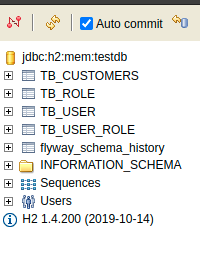
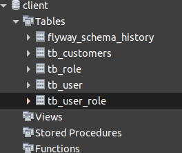
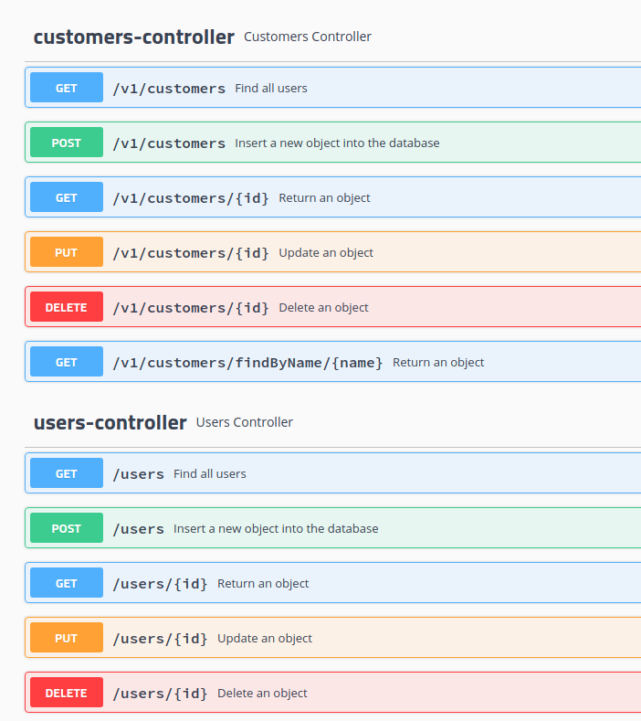

# # MBA_Full_Stack_Developer_Impacta

Disciplina: APi Gateway & Integration

## Execução dos Testes
Ative o modo dev `mvn test -Dspring-boot.run.profiles=dev`, para inicializar os testes.

## Execução do projeto em modo dev
Ative o modo dev `mvn spring-boot:run -Dspring-boot.run.profiles=dev`, para inicializar a aplicação com um banco de dados H2.

Acesse a URL: http://localhost:8080/h2

 

Ao logar certifique-se que a tabela foi criada de forma automática pelo flyway.



## Execução do projeto em modo prod

Rodar comando para criar um banco de dados mysql no docker

``` 
docker run -p 3306:3306 --name db -e MYSQL_ROOT_PASSWORD=b3RmELKOvCUrAdxIg0GEmugc3SY -e MYSQL_ROOT_HOST=% -d mysql/mysql-server:latest
```

Observação: se caso existir um banco de dados local já instalado, configure o arquivo na pasta resource/application-prod.properties 

Ative o modo prod `mvn spring-boot:run -Dspring-boot.run.profiles=prod`, para inicializar a aplicação com um banco de dados mysql.

Ao logar no banco de dados da sua prefêrencia, certifique-se que a tabela foi criada de forma automática pelo flyway.



### Para acesso a documentação acesse a URL: 

http://localhost:8080/swagger-ui.html



### Importar as configurações do PostMan

<a href=".github/archive/customers.environment.json">Variáveis de ambiente</a><br>
<a href=".github/archive/customers.collection.json">Chamadas da api-rest</a><br>


### Biblioteca usada no projeto

<ul>
    <li>ModelMapper</li>
    <li>H2</li>
    <li>Spring Security</li>
    <li>Flyway</li>
    <li>Mysql</li>
    <li>Validation</li>
    <li>Swagger</li>
</ul>

